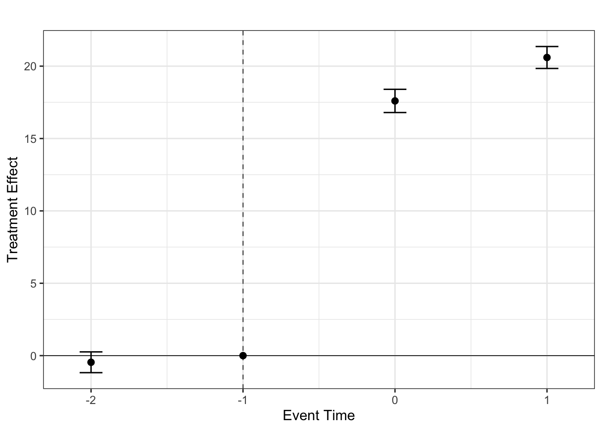

# Triple Differences Estimators 


[](https://github.com/marcelortizv/triplediff)
[](https://doi.org/10.48550/arXiv.2505.09942)

<!-- README.md is generated from README.Rmd. Please edit that file -->

**triplediff** is an R package for computing average treatment effects
in Triple Differences Designs (also known as
Difference-in-Differences-in-Differences or DDD). DDD designs are widely
used in empirical work to relax parallel trends assumptions in
Difference-in-Differences settings. This package provides functions to
estimate group-time average treatment effect and event-study type
estimands associated with DDD designs. The setups allowed are:

- Two-periods or Multiple Periods DDD.
- Single Treatment Date and Variation in Treatment Timing (i.e.,
  staggered adoption).
- Conditional and Unconditional DDD parallel trends assumptions.

The `triplediff` package implements the framework proposed in:

- [Ortiz-Villavicencio, Marcelo and Pedro H.C. Sant’Anna. "Better
  Understanding Triple Differences Estimators",
  2025.](https://arxiv.org/abs/2505.09942)

## Installation

You can install the latest *development* version of `triplediff` from
Github with:

``` r
# install.packages("devtools")
devtools::install_github("marcelortizv/triplediff")

library(triplediff)
```

## Quick Start: How to use `triplediff`

We provide a quick start example to illustrate the main features of the
package. The UX is designed to be similar to the `did` package, so users
familiar with it should feel comfortable using `triplediff`.

`ddd` is the main function for computing the DDD estimators proposed in
[Ortiz-Villavicencio and Sant’Anna
(2025)](https://arxiv.org/abs/2505.09942). At its core, `ddd` employs
regression adjustment, inverse probability weighing, and doubly robust
estimators that are valid under conditional DDD parallel trends.

To use `ddd`, the minimal data requirements include:

- `id`: Unit unique identifier (e.g., firm, individual, etc.). Its
  column name is associated with parameter `idname`.

- `period`: Time identifier (e.g., year, month, etc.). Its column name
  is associated with parameter `tname`.

- `outcome`: Outcome variable of interest. Its column name is associated
  with parameter `yname`.

- `state`: First period when treatment is enabled for a particular unit.
  It is a positive number for treated units and defines which group the
  unit belongs to. It takes value `0` or `Inf` for never-enabling units.
  Its column name is associated with parameter `gname`.

- `partition`: This is an indicator variable that is 1 for the units
  eligible for treatment and 0 otherwise. Its column name is associated
  with parameter `pname`.

The following are two simplified examples of how to use the `ddd`
function. The first one is for a two-period DDD setup, while the second
one is for a multiple-period DDD setup with staggered treatment
adoption.

#### Case: Two-Periods DDD with covariates

First, we simulate some data with a built-in function `gen_dgp_2periods`
that generates a two-period DDD setup with a single treatment date. This
function receives the number of units and the type of DGP design to
generate. The `gen_dgp_2periods` function returns a data frame with the
required columns for the `ddd` function with 4 covariates.

``` r
set.seed(1234) # Set seed for reproducibility
# Simulate data for a two-periods DDD setup
df <- gen_dgp_2periods(
  size = 5000, # Number of units
  dgp_type = 1 # Type of DGP design
)$data

head(df)
#> Key: <id>
#>       id state partition  time        y        cov1       cov2      cov3
#>    <int> <num>     <num> <int>    <num>       <num>      <num>     <num>
#> 1:     1     0         0     1 209.9152 -0.97080934 -1.1726958 2.3893945
#> 2:     1     0         0     2 417.5260 -0.97080934 -1.1726958 2.3893945
#> 3:     2     0         0     1 211.4919  0.02591115  0.2763066 0.1063123
#> 4:     2     0         0     2 420.3656  0.02591115  0.2763066 0.1063123
#> 5:     3     0         0     1 221.9431  0.97147321 -0.4292088 0.5012794
#> 6:     3     0         0     2 440.9623  0.97147321 -0.4292088 0.5012794
#>          cov4 cluster
#>         <num>   <int>
#> 1:  0.2174955      39
#> 2:  0.2174955      39
#> 3: -0.1922253      29
#> 4: -0.1922253      29
#> 5:  1.1027248      44
#> 6:  1.1027248      44
```

Now we can estimate the average treatment effect on the treated (ATT)
using the `ddd` function.

``` r
# Estimate the average treatment effect on the treated, ATT(2,2)

att_22 <- ddd(yname = "y", tname = "time", idname = "id", gname = "state",
             pname = "partition", xformla = ~cov1 + cov2 + cov3 + cov4,
             data = df, control_group = "nevertreated", est_method = "dr")

summary(att_22)
#>  Call:
#> ddd(yname = "y", tname = "time", idname = "id", gname = "state", 
#>     pname = "partition", xformla = ~cov1 + cov2 + cov3 + cov4, 
#>     data = df, control_group = "nevertreated", est_method = "dr")
#> =========================== DDD Summary ==============================
#>  DR-DDD estimation for the ATT: 
#>      ATT       Std. Error    Pr(>|t|)  [95% Ptwise. Conf. Band]              
#>     -0.0780       0.0828       0.3463      -0.2404       0.0843              
#> 
#>  Note: * indicates that the confidence interval does not contain zero.
#>  --------------------------- Data Info   -----------------------------
#>  Panel data
#>  Outcome variable: y
#>  Qualification variable: partition
#>  No. of units at each subgroup:
#>    treated-and-eligible: 1232
#>    treated-but-ineligible: 1285
#>    eligible-but-untreated: 1256
#>    untreated-and-ineligible: 1227
#>  --------------------------- Algorithms ------------------------------
#>  Outcome Regression estimated using: OLS
#>  Propensity score estimated using: Maximum Likelihood
#>  --------------------------- Std. Errors  ----------------------------
#>  Level of significance:  0.05
#>  Analytical standard errors.
#>  Type of confidence band:  Pointwise Confidence Interval
#>  =====================================================================
#>  See Ortiz-Villavicencio and Sant'Anna (2025) for details.
```

#### Case: Multiple Periods DDD with staggered treatment adoption

Next, we can simulate some data with a built-in function
`gen_dgp_mult_periods` that generates a multiple-period DDD setup with
staggered treatment adoption. This function receives the number of units
and the type of DGP design to generate. The `gen_dgp_mult_periods`
function returns a data frame with the required columns for the `ddd`
function with 4 covariates.

``` r
set.seed(1234) # Set seed for reproducibility
# Simulate data for a multiple-period DDD setup with staggered treatment adoption
data <- gen_dgp_mult_periods(size = 500, dgp_type = 1)$data

head(data)
#> Key: <id>
#>       id state partition  time         y        cov1       cov2       cov3
#>    <int> <num>     <num> <int>     <num>       <num>      <num>      <num>
#> 1:     1     3         1     1 1371.1923 -0.97080934  1.3995704 1.48834130
#> 2:     1     3         1     2 1690.9157 -0.97080934  1.3995704 1.48834130
#> 3:     1     3         1     3 2034.5661 -0.97080934  1.3995704 1.48834130
#> 4:     2     2         1     1  934.0812  0.02591115 -0.9747527 0.01714001
#> 5:     2     2         1     2 1189.5495  0.02591115 -0.9747527 0.01714001
#> 6:     2     2         1     3 1444.1072  0.02591115 -0.9747527 0.01714001
#>          cov4 cluster
#>         <num>   <int>
#> 1:  0.3853346      27
#> 2:  0.3853346      27
#> 3:  0.3853346      27
#> 4: -0.7822000      45
#> 5: -0.7822000      45
#> 6: -0.7822000      45
```

Now we can estimate the group-time average treatment effect on the
treated using the `ddd` function.

``` r
# Estimate the group-time average treatment effect in DDD

att_gt <- ddd(yname = "y", tname = "time", idname = "id", gname = "state", 
              pname = "partition", xformla = ~cov1 + cov2 + cov3 + cov4,
              data = data, control_group = "nevertreated", 
              base_period = "universal", est_method = "dr")

summary(att_gt)
#>  Call:
#> ddd(yname = "y", tname = "time", idname = "id", gname = "state", 
#>     pname = "partition", xformla = ~cov1 + cov2 + cov3 + cov4, 
#>     data = data, control_group = "nevertreated", base_period = "universal", 
#>     est_method = "dr")
#> =========================== DDD Summary ==============================
#>  DR-DDD estimation for the ATT(g,t): 
#> Group Time  ATT(g,t)  Std. Error [95% Pointwise  Conf. Band]  
#>   2    1       0.0000         NA           NA            NA   
#>   2    2      10.4901     0.3613       9.7819       11.1983  *
#>   2    3      20.5986     0.3868      19.8405       21.3568  *
#>   3    1      -0.4593     0.3660      -1.1767        0.2580   
#>   3    2       0.0000         NA           NA            NA   
#>   3    3      24.5983     0.3333      23.9450       25.2515  *
#> 
#>  Note: * indicates that the confidence interval does not contain zero.
#>  --------------------------- Data Info   -----------------------------
#>  Panel data
#>  Outcome variable: y
#>  Qualification variable: partition
#>  Control group: Never Treated
#>  No. of units per treatment group:
#>   Units enabling treatment at period 3: 198
#>   Units enabling treatment at period 2: 195
#>   Units never enabling treatment: 107
#>  --------------------------- Algorithms ------------------------------
#>  Outcome Regression estimated using: OLS
#>  Propensity score estimated using: Maximum Likelihood
#>  --------------------------- Std. Errors  ----------------------------
#>  Level of significance:  0.05
#>  Analytical standard errors.
#>  Type of confidence band:  Pointwise Confidence Interval
#>  =====================================================================
#>  See Ortiz-Villavicencio and Sant'Anna (2025) for details.
```

Then, we can aggregate the group-time average treatment effect on the
treated to obtain the event-study type estimates. The `agg_ddd` function
allows us to aggregate the results from the `ddd` function.

``` r
es_e <- agg_ddd(att_gt, type = "eventstudy")

summary(es_e)
#>  Call:
#> agg_ddd(ddd_obj = att_gt, type = "eventstudy")
#> ========================= DDD Aggregation ============================
#>  Overall summary of ATT's based on event-study/dynamic aggregation: 
#>      ATT    Std. Error     [ 95%  Conf. Int.]  
#>  19.0983        0.3213    18.4685     19.7281 *
#> 
#>  Event Study:
#>  Event time Estimate Std. Error [95% Ptwise.  Conf. Band]  
#>          -2  -0.4593     0.3660       -1.1767      0.2580  
#>          -1   0.0000         NA            NA          NA  
#>           0  17.5980     0.4095       16.7955     18.4005 *
#>           1  20.5986     0.3868       19.8405     21.3568 *
#> 
#>  Note: * indicates that the confidence interval does not contain zero.
#>  --------------------------- Data Info   -----------------------------
#>  Outcome variable: y
#>  Qualification variable: partition
#>  Control group:  Never Treated
#>  --------------------------- Std. Errors  ----------------------------
#>  Level of significance:  0.05
#>  Analytical standard errors.
#>  =====================================================================
#>  See Ortiz-Villavicencio and Sant'Anna (2025) for details.
```

From these event-study type estimates, we can plot the results using the
`ggplot` library to create crisp visualizations.

``` r
es_df <- with(es_e$aggte_ddd, {
    tibble::tibble(period   = egt,
                   estimate = att.egt,
                   ci_lower = estimate - crit.val.egt * se.egt,
                   ci_upper = estimate + crit.val.egt * se.egt)
  })


all_per <- sort(unique(es_df$period))

p <- ggplot(es_df, aes(period, estimate)) +
    geom_errorbar(aes(ymin = ci_lower, ymax = ci_upper),
                  width = .15,
                  position = position_dodge(width = .3)) +
    geom_point(size = 2.2,
               position = position_dodge(width = .3)) +
    geom_hline(yintercept = 0, linewidth = .3) +
    geom_vline(xintercept = -1, linetype = "dashed",
               linewidth = .3) +
    scale_x_continuous(
      breaks = all_per
    ) +
         labs(title = "",
         x = "Event Time",
         y = "Treatment Effect") +
    theme_bw(base_size = 12) +
    theme(plot.title   = element_text(hjust = .25),
          legend.position = "right")
  
  p
```

<!-- -->

Finally, we can also estimate the group-time average treatment effect
using a GMM-based estimator with not-yet-treated units as comparison
group. This is done by setting the `control_group` parameter to
`"notyettreated"` in the `ddd` function.

``` r
# do the same but using GMM-based notyettreated
att_gt_nyt <- ddd(yname = "y", tname = "time", idname = "id", gname = "state", 
              pname = "partition", xformla = ~cov1 + cov2 + cov3 + cov4,
              data = data, control_group = "notyettreated", 
              base_period = "universal", est_method = "dr")

summary(att_gt_nyt)
#>  Call:
#> ddd(yname = "y", tname = "time", idname = "id", gname = "state", 
#>     pname = "partition", xformla = ~cov1 + cov2 + cov3 + cov4, 
#>     data = data, control_group = "notyettreated", base_period = "universal", 
#>     est_method = "dr")
#> =========================== DDD Summary ==============================
#>  DR-DDD estimation for the ATT(g,t): 
#> Group Time  ATT(g,t)  Std. Error [95% Pointwise  Conf. Band]  
#>   2    1       0.0000         NA           NA            NA   
#>   2    2      10.1894     0.2759       9.6486       10.7302  *
#>   2    3      20.5986     0.3868      19.8405       21.3568  *
#>   3    1      -0.4593     0.3660      -1.1767        0.2580   
#>   3    2       0.0000         NA           NA            NA   
#>   3    3      24.5983     0.3333      23.9450       25.2515  *
#> 
#>  Note: * indicates that the confidence interval does not contain zero.
#>  --------------------------- Data Info   -----------------------------
#>  Panel data
#>  Outcome variable: y
#>  Qualification variable: partition
#>  Control group: Not yet Treated (GMM-based)
#>  No. of units per treatment group:
#>   Units enabling treatment at period 3: 198
#>   Units enabling treatment at period 2: 195
#>   Units never enabling treatment: 107
#>  --------------------------- Algorithms ------------------------------
#>  Outcome Regression estimated using: OLS
#>  Propensity score estimated using: Maximum Likelihood
#>  --------------------------- Std. Errors  ----------------------------
#>  Level of significance:  0.05
#>  Analytical standard errors.
#>  Type of confidence band:  Pointwise Confidence Interval
#>  =====================================================================
#>  See Ortiz-Villavicencio and Sant'Anna (2025) for details.
```

From this result, we can observe the standard errors for $ATT(2,2)$ are
lower than the ones obtained with the `control_group = "nevertreated"`
option since we leverage the additional information from the
not-yet-treated units in the estimation.

- ⚠️ We recommend users to read our paper for further details on the
  GMM-based procedure and its difference with other estimators relying
  in not-yet-treated units as comparison group.

## Release Note 📢

The current version is released in an **alpha** stage: the core features
are implemented and made available so users can try them out and provide
feedback. Please, be aware that it remains under active development, so
long-term stability is not guaranteed—APIs may evolve, adding more
features and/or breaking changes can occur at any time, without a
deprecation cycle.

Use [GitHub Issues](https://github.com/marcelortizv/triplediff/issues)
to report bugs, request features or provide feedback.

### 🚀 Currently Supported

- ️✅ Two-period DDD with single treatment date.
- ️✅ Multiple-period DDD with single treatment date.
- ️✅ DDD with staggered treatment adoption (i.e., more than two periods
  and variation in treatment timing).
- ️✅ Aggregations procedures (e.g., event-study type estimates).
- ️✅ GMM-based estimations with not-yet-treated units as comparison
  group.

### ⚠️ Not Yet Supported

- 🔲 Built-in plotting capabilities for visualizing results.
  - This can be done easily by users. E.g., event-study type estimates
    can be plotted using `ggplot2`. See the quick start example.
- 🔲 User-specified data-driven models for estimations of nuisance
  parameters.
- 🔲 Repeated cross-sectional data.
- 🔲 Unbalanced panel data.
